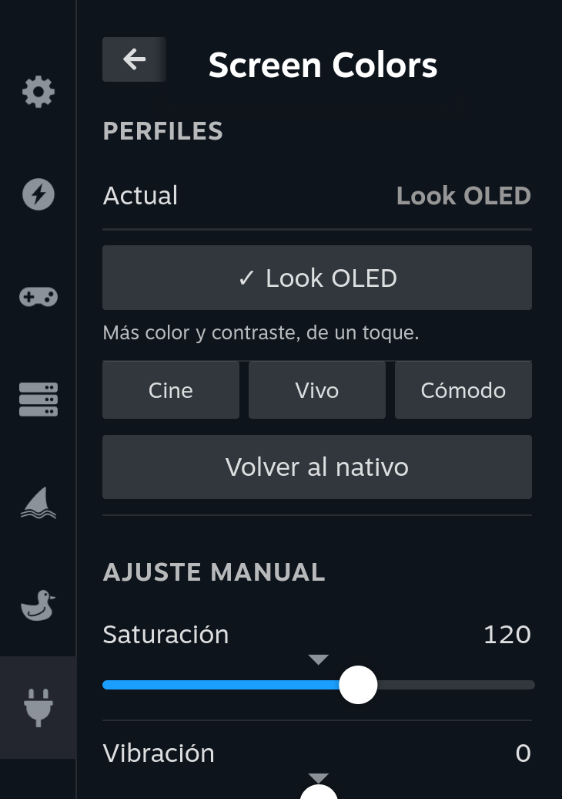

<h1 align="center">Screen Colors</h1>

<p align="center">
  A <b>Decky Loader</b> plugin to adjust the screen colors of handhelds running
  gamescope (Steam Deck and similar) — saturation, vibrance, temperature,
  contrast, gamma, black level, hue and per-channel RGB gains, plus a one-tap
  <b>OLED look</b> and ready-made presets.
</p>

<p align="center">
  
</p>

<p align="center">
  <a href="https://github.com/PacificSilent/decky-screen-colors/releases/latest">
    
  </a>
  
</p>

> 🇪🇸 **[Versión en español más abajo.](#español)**

---

## Features

- **OLED look** — one tap: more color and contrast, to bring an LCD closer to the
  look of an OLED panel.
- **Presets** — Cinema, Vivid and Comfort: complete, ready-made looks.
- **Manual adjustment** — saturation, vibrance, temperature, contrast, gamma and
  black level, applied live.
- **Advanced** — hue and per-channel RGB gains, hidden behind a toggle so the
  panel stays simple.
- **It sticks** — your look is saved and re-applied automatically after a reboot,
  a Steam restart, or a trip to Desktop Mode and back.
- **English and Spanish** — the UI follows your Steam language automatically.

## Install

**From the release ZIP (easiest):**

1. In Game Mode, open Decky → gear icon → enable **Developer Mode**.
2. In the **Developer** tab, choose **Install Plugin from ZIP**.
3. Pick [the latest release ZIP](https://github.com/PacificSilent/decky-screen-colors/releases/latest)
   (`decky-screen-colors.zip`).

**Manually:** copy the `Screen Colors` folder from the ZIP into
`~/homebrew/plugins/` on your device and restart the Decky service (or reboot).

## Usage

Open the **Quick Access Menu** (**⋯** button) and pick **Screen Colors**.

| Control | What it does |
| --- | --- |
| **OLED look** | Saturation 120 + contrast 20. It approximates the *color* of an OLED; it cannot give true per-pixel blacks. |
| **Cinema / Vivid / Comfort** | Complete looks: Cinema is warm and contrasty, Vivid pushes color hard, Comfort is warmer and softer for night-time. |
| **Manual adjustment** | Fine-tune each parameter. Changes apply live and are saved. |
| **Hue and RGB gains** | White-balance tweaks, for when a panel pulls green or magenta. |
| **Reset to native** | Back to the panel's original color. |

The **Current** line at the top always tells you which look is applied
(*Native*, *OLED look*, a preset, or *Custom*).

## How it works

The plugin generates a **3D LUT (`.cube`)** and loads it through gamescope's
Wayland control socket with `gamescopectl set_look` (hence the root permission).
This is the mechanism that works on current SteamOS — unlike the old X11-atom
approach, which stopped working on modern (Wayland) gamescope.

The LUT lives inside the running gamescope instance, so it is lost whenever
gamescope restarts (reboot, Steam restart, Desktop Mode round-trip). The backend
watches for a new gamescope instance and re-applies your saved look, so you don't
have to touch the panel again after a reboot.

If no responding gamescope socket is present (e.g. in Desktop Mode), the UI says
so and does nothing.

## Build from source

```bash
pnpm install
pnpm run build      # produces dist/index.js
```

Then package `main.py`, `plugin.json`, `package.json`, `dist/`, `LICENSE`,
`CREDITS.md` and `README.md` into a ZIP whose top-level folder is named
`Screen Colors`.

## Credits and license

Written by [PacificSilent](https://github.com/PacificSilent). The color engine is
derived from [panel-de-control](https://github.com/Hooandee/panel-de-control) by
Hooandee (GPL-3.0) — see `CREDITS.md`.

GNU GPL v3.0 or later — see `LICENSE`.

---

<h1 align="center">Español</h1>

Un plugin de **Decky Loader** para ajustar los colores de la pantalla en
portátiles con gamescope (Steam Deck y similares): saturación, vibración,
temperatura, contraste, gamma, nivel de negro, tono y ganancias RGB por canal,
más un **Look OLED** de un toque y perfiles listos para usar.

## Características

- **Look OLED** — de un toque: más color y contraste, para acercar un LCD al
  aspecto de un panel OLED.
- **Perfiles** — Cine, Vivo y Cómodo: looks completos ya calibrados.
- **Ajuste manual** — saturación, vibración, temperatura, contraste, gamma y
  nivel de negro, aplicados en vivo.
- **Avanzado** — tono y ganancias RGB por canal, detrás de un interruptor para
  que el panel siga siendo simple.
- **No se pierde** — tu look se guarda y se vuelve a aplicar solo tras reiniciar
  la consola, reiniciar Steam o volver del Modo Escritorio.
- **Español e inglés** — la interfaz sigue automáticamente el idioma de Steam.

## Instalación

**Desde el ZIP del release (lo más fácil):**

1. En Modo Juego, abre Decky → engranaje → activa **Developer Mode**.
2. En la pestaña **Developer**, usa **Install Plugin from ZIP**.
3. Elige [el ZIP del último release](https://github.com/PacificSilent/decky-screen-colors/releases/latest)
   (`decky-screen-colors.zip`).

**Manual:** copia la carpeta `Screen Colors` del ZIP en `~/homebrew/plugins/` de
tu consola y reinicia el servicio de Decky (o la consola).

## Uso

Abre el **Menú de Acceso Rápido** (botón **⋯**) y entra en **Screen Colors**.

| Control | Qué hace |
| --- | --- |
| **Look OLED** | Saturación 120 + contraste 20. Aproxima el *color* de un OLED; no da negros reales por píxel. |
| **Cine / Vivo / Cómodo** | Looks completos: Cine cálido y contrastado, Vivo empuja el color a tope, Cómodo más cálido y suave para la noche. |
| **Ajuste manual** | Afina cada parámetro. Se aplica en vivo y se guarda. |
| **Tono y ganancias RGB** | Ajustes de balance de blancos, para paneles que tiran a verde o magenta. |
| **Volver al nativo** | Regresa al color original del panel. |

La línea **Actual** de arriba siempre indica qué look está puesto (*Nativo*,
*Look OLED*, un perfil o *Personalizado*).

## Cómo funciona

Genera un **LUT 3D (`.cube`)** y lo carga por el socket de control Wayland de
gamescope con `gamescopectl set_look` (por eso pide permiso de root). Es el
mecanismo vigente en SteamOS actual, a diferencia del método viejo por atom de
X11, que dejó de funcionar en el gamescope moderno (Wayland).

El LUT vive dentro de la instancia de gamescope, así que se pierde cada vez que
gamescope se reinicia (reinicio de la consola, de Steam, o ida y vuelta al Modo
Escritorio). El backend detecta la nueva instancia y vuelve a aplicar tu look
guardado, así que no tienes que abrir el panel otra vez después de reiniciar.

Si no hay un socket de gamescope que responda (p. ej. en Modo Escritorio), la
interfaz lo indica y no hace nada.

## Compilar desde el código

```bash
pnpm install
pnpm run build      # genera dist/index.js
```

Después empaqueta `main.py`, `plugin.json`, `package.json`, `dist/`, `LICENSE`,
`CREDITS.md` y `README.md` en un ZIP cuya carpeta raíz se llame `Screen Colors`.

## Créditos y licencia

Escrito por [PacificSilent](https://github.com/PacificSilent). El motor de color
deriva de [panel-de-control](https://github.com/Hooandee/panel-de-control) de
Hooandee (GPL-3.0) — ver `CREDITS.md`.

GNU GPL v3.0 o posterior — ver `LICENSE`.
